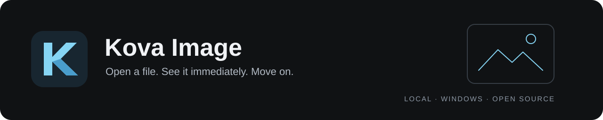
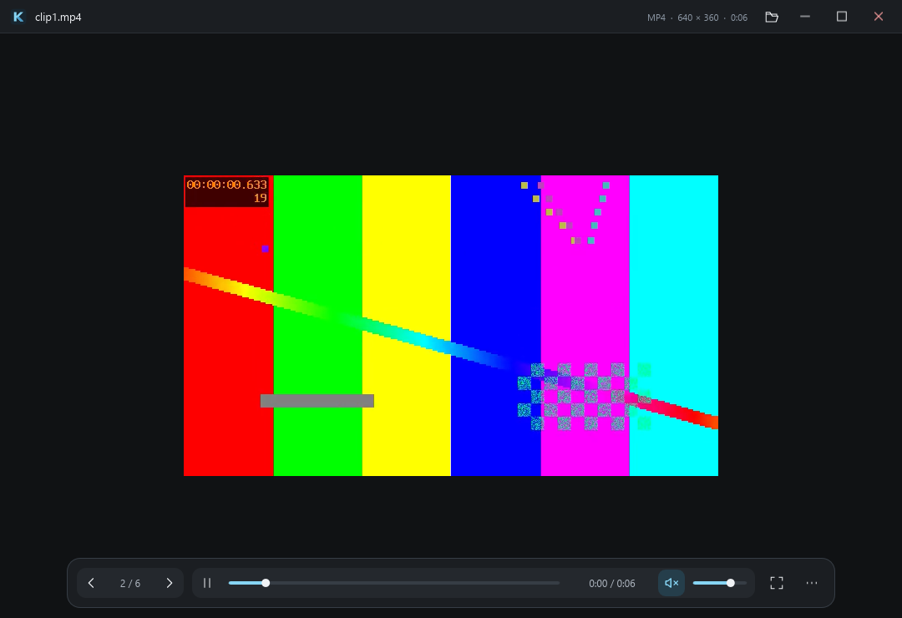

<p align="center">
  
</p>

# Kova Image

<p align="center">A fast, lightweight local image and video viewer for Windows.</p>

<p align="center">
  <a href="https://github.com/cubiix3/Kova-Image/actions/workflows/ci.yml"></a>
  <a href="https://github.com/cubiix3/Kova-Image/actions/workflows/security.yml"></a>
  <a href="#current-status"></a>
  <a href="LICENSE"></a>
</p>

<p align="center">
  <a href="#screenshots">Screenshots</a> &middot;
  <a href="#installation--running">Get started</a> &middot;
  <a href="#supported-formats">Formats</a> &middot;
  <a href="docs/README.md">Documentation</a> &middot;
  <a href="CONTRIBUTING.md">Contribute</a>
</p>

> **Early Development - 0.1.0.** The viewer is usable for evaluation, with known
> limitations. The per-user installer and portable ZIP on the
> [releases page](https://github.com/cubiix3/Kova-Image/releases) are unsigned
> and not yet tested on a clean machine; see the
> [validation record](docs/VALIDATION.md).

## What is Kova Image?

A standalone, native Windows image, animation and local video viewer in the
[Kova product family](https://github.com/cubiix3/Kova-File-Manager). Built with **Rust, Slint and official Windows APIs**. Open a file,
see it, and move through its folder. Kova Image is a viewer, not an editor.

## Screenshots

<p align="center">
  
  <br><sub>A compact titlebar and floating controls keep your content central.</sub>
</p>

| Images and animations | Local video |
| :---: | :---: |
| [](docs/images/viewer.png) | [](docs/images/video.png) |
| Fit, zoom, pan and view transforms with brief action feedback | Play, pause, seek and volume with automatically hiding controls |

These are captures from the running application, using original synthetic test
files. No mock UI or personal media. Click an image to view it at full size.

## Goals

- Keep opening and navigation responsive, including while decoding fails.
- Bound image memory, cache retention, speculative work and queued requests.
- Keep the image central, with a compact, dark interface.
- No accounts, cloud, telemetry, gallery database or background services.

## Current status

Windows 10/11 x64 is the target. The 0.1.0 source provides the viewer workflow,
animation, native video, mixed-media folder navigation and Windows actions
below. This is a first implementation, with no stability or performance guarantees. Hardware diversity,
color management, accessibility and hostile-file coverage need more validation.

## Features

| Area | Implemented behavior |
| --- | --- |
| Open and navigate | CLI path, native picker, file drop, natural sorting, previous/next/first/last and mixed-media folders |
| Images | Fit, fit width, 100%, cursor-centered zoom, pan, rotation and horizontal/vertical flip |
| Animation | GIF, animated WebP and APNG, with pause, timing, loops and bounded frame storage |
| Video | Play/pause, timeline, current time/duration, mute/volume and optional loop |
| Interface | Compact titlebar, floating controls with windowed/fullscreen auto-hide, action feedback and visible keyboard focus |
| Windows | Copy image or path, Recycle Bin, Show in Explorer, Open with and opt-in app registration |

Rotation and flips affect the view only. Copy Image copies the decoded frame
before view transforms. Original files are never rewritten. Each launch opens
an independent window; there is no single-instance IPC service.

## Supported formats

| Format | Current implementation |
| --- | --- |
| JPEG / JPG | Still image; EXIF orientation applied |
| PNG | Still image |
| GIF | Animation, timing, loops, transparency and disposal |
| WebP | Still and animated |
| APNG | Animation, timing, loops, blending and disposal |
| BMP | Still image |
| TIFF | First image/page |
| ICO | Decoder-selected icon image |
| MP4 / M4V, MOV, MKV | Windows codecs; H.264/AAC tested in MP4, MOV and MKV |
| WebM | Windows codec dependent; VP8/VP9 samples fail gracefully on the test machine without a matching decoder |
| AVIF | Planned; no decoder shipped yet |
| HEIC/HEIF, JPEG XL, SVG, RAW | Not supported; evaluation remains on the roadmap |

Decoders validate file contents. Extensions filter folder navigation and the
file picker, and suggest video handling. An explicitly opened supported image
can have an unusual extension. Video containers require a recognized header and a local
drive path. Container support does not guarantee every codec/profile will play.
No codec downloads, streaming, DRM, subtitles or audio-only player are provided.
See [video architecture and limits](docs/VIDEO.md). SVG is never rendered.

## Installation / Running

Download `Kova-Image-<version>-x64-setup.exe` from the
[releases page](https://github.com/cubiix3/Kova-Image/releases) and run it. It
installs for the current user only, so it needs no administrator rights, and it
uninstalls through Settings > Apps. The build is unsigned, so SmartScreen warns
on first run. A portable ZIP is published alongside it if you would rather not
install anything.

Command line, whether installed or built from source:

```powershell
.\target\release\kova-image.exe
.\target\release\kova-image.exe "C:\Pictures\example.png"
.\target\release\kova-image.exe "C:\Videos\example.mp4"
.\target\release\kova-image.exe --software "C:\Pictures\example.png"
```

`--software` selects the rendering fallback. The default uses OpenGL through
Slint's FemtoVG renderer. Keep any packaged runtime DLLs alongside the executable.
See [Windows builds and packaging](docs/WINDOWS_RELEASE.md). Video also requires
the Windows Media Foundation components (Windows N installations may lack them).

To enable **Open with**, keep the executable in a permanent folder - the
installer offers this as an optional step - then use Settings >
**Register Kova Image for Open with**, followed by **Choose default viewer in
Windows Settings**. Or run `kova-image.exe --register-file-associations`.
Registration is per-user, needs no elevation and never changes protected
`UserChoice` defaults. [Registration details](docs/FILE_ASSOCIATIONS.md).

## Building from source

Install Rust and the **Desktop development with C++** workload, including a
Windows SDK, from either Visual Studio or the standalone Visual Studio Build
Tools. The pinned toolchain is Rust 1.95.0 (MSVC).

```powershell
git clone https://github.com/cubiix3/Kova-Image.git
cd Kova-Image
.\scripts\cargo-msvc.ps1 -CargoArgs @('build', '--locked', '--release', '--bin', 'kova-image')
```

From a Visual Studio Developer PowerShell:

```powershell
cargo fmt --all -- --check
cargo check --locked --all-targets
cargo clippy --locked --all-targets -- -D warnings
cargo test --locked
```

The first build downloads Rust dependencies. Application startup performs no
update check or dependency download. [Dependency decisions](docs/DEPENDENCIES.md)
distinguish build tooling from shipped code.

## Keyboard / Mouse controls

| Action | Control |
| --- | --- |
| Open image / video | `Ctrl+O` or drop a file |
| Previous / next | `Left` / `Right`, mouse Back / Forward |
| First / last | `Home` / `End` |
| Zoom in / out | `+` / `-`, mouse wheel |
| Fit / fit width / 100% | `0` / `W` / `1` |
| Pan | Drag the image with the left mouse button |
| Fullscreen / exit fullscreen | `F11` / `Esc`; double-click the canvas to toggle |
| Pause / resume animation or video | `Space` |
| Seek video by 5 seconds | `Ctrl+Left` / `Ctrl+Right` |
| Mute / unmute video | `M` |
| Rotate right / left | `R` / `Shift+R` |
| Flip horizontal / vertical | `H` / `V` |
| File information | `I` |
| Copy image / path (video: both copy path) | `Ctrl+C` / `Ctrl+Shift+C` |
| Move to Recycle Bin | `Delete` |

Image zoom, rotation and flip tools apply only to images. Video uses Fit to
Window. Timeline and volume accept pointer dragging; focused sliders use arrow
keys. Left/Right otherwise navigate the same mixed-media folder.

The More panel contains Windows actions and settings. Shortcuts are defined in
`src/input.rs`. Wheel navigation can replace wheel zoom in Settings.
Settings live in `%LOCALAPPDATA%\Kova Image\settings.conf`.

Viewing controls float over the image and hide after two seconds of inactivity.
Move the pointer or press Tab to bring them back; the windowed titlebar stays
available. Zoom, playback and volume shortcuts show brief feedback even with
the controls hidden. Auto-hide can be disabled in Settings.

## Performance philosophy

The current image takes priority over preloads. A single decode worker replaces
pending requests, checks cancellation where codecs permit it and preloads only
the next/previous image. Folder scanning and Shell operations stay off the UI thread.

The weighted LRU retains at most **192 MiB of pixel data and 32 entries**.
Displayed pixels, decoder scratch space and GPU textures cost additional memory;
this is not a process-RAM cap. Animated images are currently collected within a
bounded budget before playback. Scaled decoding and streaming animation are future work.

Video initializes its own worker on demand. Media Foundation owns audio/video
timing; a bounded mailbox retains the latest pending frame. Pixel-buffer
preparation runs on the worker, with D3D readback and Slint upload as explicit
costs. Presentation is capped at **1920 x 1080**. Minimizing pauses video and audio.

[Measurement protocol](docs/PERFORMANCE.md) -
[Recorded startup, video CPU and RAM](docs/VIDEO_MEASUREMENTS.md) -
[Interface design](docs/DESIGN.md)

## Security philosophy

Every image and video is untrusted input. Validate dimensions with overflow-safe arithmetic,
limit file size and decoded storage, reject unsupported formats, and keep decoder
errors away from the UI thread. Reparse-point files are rejected on Windows;
open image handles deny writes and deletion while decoding. There is no image-
initiated network access. Recycle operations veto permanent-deletion fallback.

Resource limits and panic recovery are not a sandbox. Native faults, allocator
aborts, renderer faults and codec-internal allocations need further defense.
Read [SECURITY.md](SECURITY.md) and the
[security architecture](docs/SECURITY_ARCHITECTURE.md). Report sensitive problems
privately through GitHub Security Advisories.

## Roadmap

- [AVIF decoding](https://github.com/cubiix3/Kova-Image/issues/3) with an acceptable license, bounded memory and repeatable builds.
- [Progressive/scaled decode and streaming animations](https://github.com/cubiix3/Kova-Image/issues/4), with measured navigation tuning.
- [Fuzzing and stronger file identity checks](https://github.com/cubiix3/Kova-Image/issues/6), including decoder isolation evaluation.
- [Validated portable packages and an installer](https://github.com/cubiix3/Kova-Image/issues/5), with signing and opt-in file associations.
- Broader GPU/DPI/accessibility validation and color-management evaluation.
- Evaluate HEIC/HEIF and JPEG XL; hardened SVG and RAW only if justified.

No image editing, albums, tags, cloud, AI, streaming, music library or PDF support is planned.

## Contributing

See [CONTRIBUTING.md](CONTRIBUTING.md). Keep changes focused on the viewer.
Architecture and current tradeoffs are described in [docs/ARCHITECTURE.md](docs/ARCHITECTURE.md).

## License

MIT OR Apache-2.0, matching [Kova File](https://github.com/cubiix3/Kova-File-Manager).
See [LICENSE](LICENSE), [LICENSE-MIT](LICENSE-MIT), and
[LICENSE-APACHE](LICENSE-APACHE). Dependencies retain their own licenses.

Made with [Slint](https://slint.dev). See
[third-party notices](THIRD_PARTY_NOTICES.md) for licensing and Kova asset provenance.

<p align="center"><a href="https://slint.dev"></a></p>
