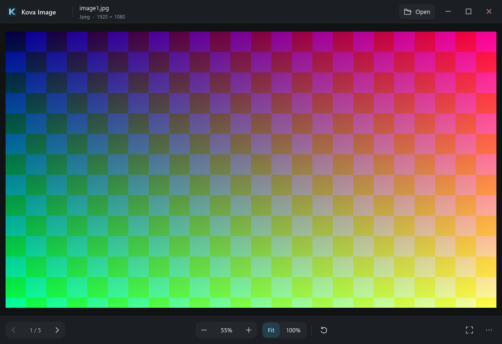

<p align="center">
  
</p>

<h1 align="center">Kova Image</h1>
<p align="center">A fast, lightweight local image and video viewer for Windows.</p>

<p align="center">
  <a href="https://github.com/cubiix3/Kova-Image/actions/workflows/ci.yml"></a>
  <a href="LICENSE"></a>
</p>

> **Status: Early Development — 0.1.0.** The initial viewer is implemented.
> There is no stable release or installer yet. Build from source to try it.
> See [verification and limitations](docs/VALIDATION.md).

<p align="center"><a href="https://slint.dev"></a></p>

## What is Kova Image?

A standalone, native Windows image, animation and local video viewer in the Kova product
family. Built with **Rust, Slint and official Windows APIs**. Open a file,
see it, and move through its folder. Kova Image is a viewer, not an editor.



## Goals

- Keep opening and navigation responsive, including while decoding fails.
- Bound image memory, cache retention, speculative work and queued requests.
- Keep the image central, with a compact, dark interface.
- No accounts, cloud, telemetry, gallery database or background services.

## Current status

Windows 10/11 x64 is the target. The 0.1.0 source provides the viewer workflow,
animation, native video, mixed-media folder navigation and Windows actions below. This is a first
implementation, with no stability or performance guarantees. Hardware diversity,
color management, accessibility and hostile-file coverage need more validation.

## Features

- Open by CLI path, native file picker, or file drop.
- Previous/next/first/last, with natural sorting in the current folder.
- Fit, fit width, 100%, cursor-centered wheel zoom and drag to pan.
- Fullscreen with auto-hiding controls; rotation and horizontal/vertical flips.
- GIF, animated WebP and APNG playback with pause and bounded frame storage.
- Local video with play/pause, timeline seeking, time, volume/mute and optional loop.
- Copy the original decoded image/current animation frame or Unicode path.
- Move a loaded file to the Windows Recycle Bin, reveal it in Explorer, or
  open the native **Open with** dialog.
- Small information and settings panels, local settings and sharp-pixel mode.
- Opt-in **Open with** registration and a link to Windows Default Apps Settings.
- Asynchronous decoding, latest-request priority, stale-result rejection and
  next/previous preloading through a bounded, weighted LRU cache.

Rotation and flips affect the view only. Copy Image copies the decoded frame
before view transforms. Original files are never rewritten. Each launch opens
an independent window; there is no single-instance IPC service.

## Supported formats

| Format | Current implementation |
| --- | --- |
| JPEG / JPG | Still image; EXIF orientation applied |
| PNG | Still image |
| GIF | Animation, timing, loops, transparency and disposal |
| WebP | Still and animated |
| APNG | Animation, timing, loops, blending and disposal |
| BMP | Still image |
| TIFF | First image/page |
| ICO | Decoder-selected icon image |
| MP4 / M4V, MOV, MKV | Windows Media Foundation; tested with H.264 + AAC |
| WebM | Windows codec dependent; VP8/VP9 samples fail gracefully on the test machine without a matching decoder |
| AVIF | Planned; no decoder shipped yet |
| HEIC/HEIF, JPEG XL, SVG, RAW | Not supported; evaluation remains on the roadmap |

File contents determine the decoder. Extensions are used only to filter folder
navigation and the file picker. An explicitly opened supported image can have
an unusual extension. Video containers require a recognized header and a local
drive path. Container support does not guarantee every codec/profile will play.
No codec downloads, streaming, DRM, subtitles or audio-only player are provided.
See [video architecture and limits](docs/VIDEO.md). SVG is never rendered.

## Installation / Running

There is no published installer or stable binary. After building:

```powershell
.\target\release\kova-image.exe
.\target\release\kova-image.exe "C:\Pictures\example.png"
.\target\release\kova-image.exe --software "C:\Pictures\example.png"
```

`--software` selects the rendering fallback. The default uses OpenGL through
Slint's FemtoVG renderer. Keep any packaged runtime DLLs alongside the executable.
See [Windows builds and packaging](docs/WINDOWS_RELEASE.md). Video also requires
the Windows Media Foundation components (Windows N installations may lack them).

To enable **Open with**, keep the executable in a permanent folder, then use
Settings > **Register Kova Image for Open with**, followed by **Choose default
viewer in Windows Settings**. Or run `kova-image.exe --register-file-associations`.
Registration is per-user, needs no elevation and never changes protected
`UserChoice` defaults. [Registration details](docs/FILE_ASSOCIATIONS.md).

## Building from source

Install Rust and Visual Studio's **Desktop development with C++** workload,
including a Windows SDK. The pinned toolchain is Rust 1.95.0 (MSVC).

```powershell
git clone https://github.com/cubiix3/Kova-Image.git
cd Kova-Image
.\scripts\cargo-msvc.ps1 build --locked --release --bin kova-image
```

From a Visual Studio Developer PowerShell:

```powershell
cargo fmt --all -- --check
cargo check --locked --all-targets
cargo clippy --locked --all-targets -- -D warnings
cargo test --locked
```

The first build downloads Rust dependencies. Application startup performs no
update check or dependency download. [Dependency decisions](docs/DEPENDENCIES.md)
distinguish build tooling from shipped code.

## Keyboard / Mouse controls

| Action | Control |
| --- | --- |
| Open image / video | `Ctrl+O` or drop a file |
| Previous / next | `Left` / `Right`, mouse Back / Forward |
| First / last | `Home` / `End` |
| Zoom in / out | `+` / `-`, mouse wheel |
| Fit / fit width / 100% | `0` / `W` / `1` |
| Pan | Drag the image with the left mouse button |
| Fullscreen / exit fullscreen | `F11` / `Esc`; double-click the canvas to toggle |
| Pause / resume animation or video | `Space` |
| Seek video by 5 seconds | `Ctrl+Left` / `Ctrl+Right` |
| Mute / unmute video | `M` |
| Rotate right / left | `R` / `Shift+R` |
| Flip horizontal / vertical | `H` / `V` |
| File information | `I` |
| Copy image / path (video: both copy path) | `Ctrl+C` / `Ctrl+Shift+C` |
| Move to Recycle Bin | `Delete` |

Image zoom, rotation and flip tools apply only to images. Video uses Fit to
Window. Timeline and volume accept pointer dragging; focused sliders use arrow
keys. Left/Right otherwise navigate the same mixed-media folder.

The More panel contains Windows actions and settings. Shortcuts are defined in
`src/input.rs`. Wheel navigation can replace wheel zoom in Settings.
Settings live in `%LOCALAPPDATA%\Kova Image\settings.conf`.

## Performance philosophy

The [interface design system](docs/DESIGN.md) keeps the image central, with
grouped controls, explicit keyboard focus and restrained fullscreen overlays.

No splash screen, database, thumbnails for every file or startup indexing.
The current image wins over preloads. A single decode worker replaces pending
requests, checks cancellation on file reads and frame boundaries, and preloads
only the next and previous image. Codecs cannot all be interrupted during their
internal CPU work. Folder scanning and Shell operations stay off the UI thread.

Decoded frames share storage with the cache. The cache retains at most 192 MiB
of pixel data and 32 entries. A displayed image, decoder scratch space, Slint
frame upload and GPU textures have additional costs; this is not a process-RAM
cap. Large images and animations may be rejected before exhausting these budgets.

Current decoders produce full-resolution images. Scaled decode and streaming
animation are future work. Animations currently decode into a bounded collection
before playback. Timers sleep between frames and stop when paused/minimized.
See [reproducible measurements](docs/PERFORMANCE.md); no benchmark superiority
is claimed.

Video initializes a separate bounded worker only on demand. Media Foundation
owns audio/video timing; the app retains only the latest pending video frame.
Presentation is capped at 1920 x 1080 with CPU readback and Slint upload; native
codec and GPU memory are additional costs. Minimizing pauses video and audio.

Measured startup, executable size and video CPU/RAM are recorded in
[VIDEO_MEASUREMENTS.md](docs/VIDEO_MEASUREMENTS.md).

## Security philosophy

Every image and video is untrusted input. Validate dimensions with overflow-safe arithmetic,
limit file size and decoded storage, reject unsupported formats, and keep decoder
errors away from the UI thread. Reparse-point files are rejected on Windows;
open image handles deny writes and deletion while decoding. There is no image-
initiated network access. Recycle operations veto permanent-deletion fallback.

Resource limits and panic recovery are not a sandbox. Native faults, allocator
aborts, renderer faults and codec-internal allocations need further defense.
Read [SECURITY.md](SECURITY.md) and the
[security architecture](docs/SECURITY_ARCHITECTURE.md). Report sensitive problems
privately through GitHub Security Advisories.

## Roadmap

- [AVIF decoding](https://github.com/cubiix3/Kova-Image/issues/3) with an acceptable license, bounded memory and repeatable builds.
- [Progressive/scaled decode and streaming animations](https://github.com/cubiix3/Kova-Image/issues/4), with measured navigation tuning.
- [Fuzzing and stronger file identity checks](https://github.com/cubiix3/Kova-Image/issues/6), including decoder isolation evaluation.
- [Validated portable packages and an installer](https://github.com/cubiix3/Kova-Image/issues/5), with signing and opt-in file associations.
- Broader GPU/DPI/accessibility validation and color-management evaluation.
- Evaluate HEIC/HEIF and JPEG XL; hardened SVG and RAW only if justified.

No image editing, albums, tags, cloud, AI, streaming, music library or PDF support is planned.

## Contributing

See [CONTRIBUTING.md](CONTRIBUTING.md). Keep changes focused on the viewer.
Architecture and current tradeoffs are described in [docs/ARCHITECTURE.md](docs/ARCHITECTURE.md).

## License

MIT OR Apache-2.0, matching [Kova File](https://github.com/cubiix3/Kova-File-Manager).
See [LICENSE](LICENSE), [LICENSE-MIT](LICENSE-MIT), and
[LICENSE-APACHE](LICENSE-APACHE). Dependencies retain their own licenses.

Made with [Slint](https://slint.dev). See
[third-party notices](THIRD_PARTY_NOTICES.md) for licensing and Kova asset provenance.
