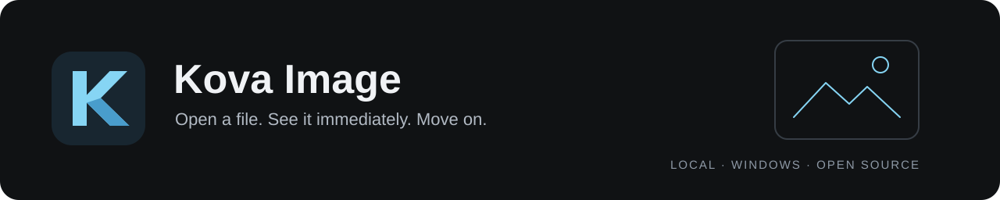
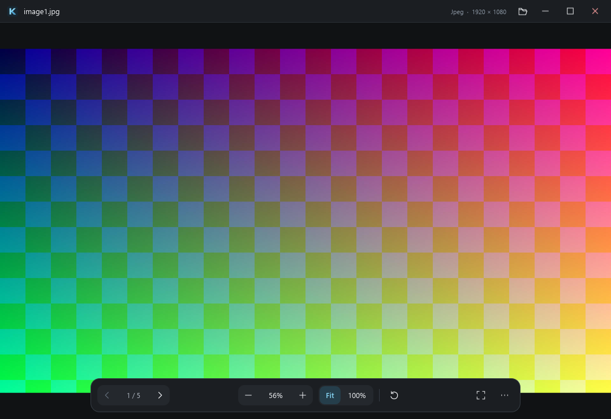
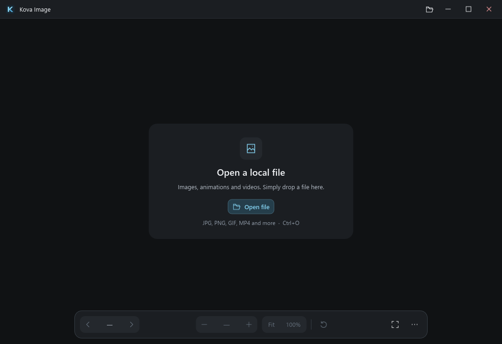
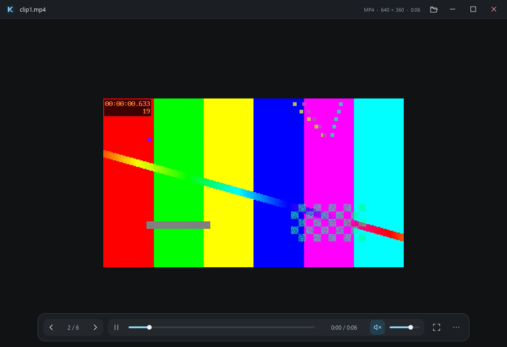

<p align="center">
  
</p>

<h1 align="center">Kova Image</h1>

<p align="center">
  <b>A fast, quiet image, video and audio viewer for Windows.</b><br>
  Native Rust. No accounts, no cloud, no telemetry. Just your files.
</p>

<p align="center">
  <a href="https://github.com/cubiix3/Kova-Image/releases/latest"></a>
  <a href="https://github.com/cubiix3/Kova-Image/actions/workflows/ci.yml"></a>
  <a href="https://github.com/cubiix3/Kova-Image/actions/workflows/security.yml"></a>
  
  <a href="#license"></a>
</p>

<p align="center">
  <a href="#download">Download</a> &nbsp;&middot;&nbsp;
  <a href="#highlights">Highlights</a> &nbsp;&middot;&nbsp;
  <a href="#supported-formats">Formats</a> &nbsp;&middot;&nbsp;
  <a href="#keyboard-and-mouse">Shortcuts</a> &nbsp;&middot;&nbsp;
  <a href="#building-from-source">Build</a> &nbsp;&middot;&nbsp;
  <a href="docs/README.md">Docs</a>
</p>

<p align="center">
  
</p>

---

## Why Kova Image?

Opening a picture should take a moment, not a splash screen. Kova Image opens
a file, shows it, and lets you move through its folder with the arrow keys.
The interface stays out of the way: a compact titlebar and floating controls
fade out after two seconds so the image is all you see.

It is a **viewer, not an editor**, built with **Rust, [Slint](https://slint.dev)
and official Windows APIs**. It is a sibling of
[Kova Screen](https://github.com/cubiix3/Kova-Screen).

> [!NOTE]
> **Early development, version 0.3.0.** Kova Image is ready to try, with known
> limitations. Release builds are unsigned, so Windows SmartScreen warns on
> first run. See the [validation record](docs/VALIDATION.md) for what has been
> tested.

## Highlights

|  |  |
| --- | --- |
| ⚡ **Instant navigation** | The current image always wins. Once you pause on a picture, the next two files in your direction of travel are decoded in advance. |
| 🎞️ **Animations and video** | GIF, APNG and animated WebP with correct timing and loops. Local MP4, MOV and MKV through Windows Media Foundation. |
| 🎵 **Audio** | MP3, M4A, AAC, WAV, FLAC and WMA play with the video controls, and the next song in the folder is one key away. Title, artist and cover are read from the file and shown. |
| 🎨 **Real color** | Embedded ICC profiles are converted to sRGB. EXIF orientation is applied automatically. |
| 📦 **Formats built in** | WebP, AVIF, HEIC, JPEG XL, SVG, camera RAW, DDS, TGA and more open without any Windows codec or extension, and Explorer can show their thumbnails. See [Supported formats](#supported-formats). |
| 🧠 **Bounded memory** | Images are decoded at the size your view needs, and the cache is capped at 192 MiB of pixels. Photos up to 64 megapixels open without a full-size RGBA copy. |
| 🛡️ **Careful with files** | Every file is treated as untrusted. Deleting goes to the Recycle Bin, and `Ctrl+Z` brings it back. |
| 🪟 **At home on Windows** | Per-user install, Open with registration, high contrast and reduced motion follow your system settings. |

## Screenshots

| Start screen | Local video |
| :---: | :---: |
| [](docs/images/empty.png) | [](docs/images/video.png) |
| Nothing to set up. Open or drop a file. | Play, pause, seek and volume, with controls that hide themselves. |

All screenshots come from the running app with synthetic test files. They are
not mockups and contain no personal media.

## Download

1. Download **`Kova-Image-<version>-x64-setup.exe`** from the
   [latest release](https://github.com/cubiix3/Kova-Image/releases/latest).
2. Run it. It installs for your user only and needs no administrator rights.
3. Optional: in the app, open **More → Settings → Register Kova Image for Open with**,
   then pick Kova Image as your default viewer in Windows Settings.

Prefer not to install? Download the **portable ZIP** from the same release,
unpack it anywhere and start `kova-image.exe`. Uninstall through
**Settings → Apps** like any other app.

<details>
<summary><b>Command line options</b></summary>

```powershell
kova-image.exe                                    # start screen
kova-image.exe "C:\Pictures\example.png"          # open an image
kova-image.exe "C:\Videos\example.mp4"            # open a video
kova-image.exe "C:\Music\example.mp3"             # play a song
kova-image.exe --software "C:\Pictures\photo.jpg" # CPU renderer instead of OpenGL
kova-image.exe --register-file-associations       # per-user Open with registration
```

Registration never touches the protected `UserChoice` defaults; Windows keeps
the final say. See [file associations](docs/FILE_ASSOCIATIONS.md). Video and audio
need the Windows Media Foundation components, which Windows N editions may lack.

</details>

## Features

| Area | What you get |
| --- | --- |
| **Open and browse** | Command line, file picker or drag and drop. Sorted like Explorer (`img2` before `img10`, umlauts next to their letter) or by date or size, optionally reversed. `PageUp`/`PageDown`, first/last, optional wrap-around, and folders that mix images and videos. |
| **Slideshow** | `F5` starts a slideshow at 3, 5, 10 or 30 seconds. A video plays to its end first. |
| **View** | Fit to window, fit width, 100%, zoom around the cursor, pan, rotate and flip. A faint grid shows through transparent images. The view is never written back to the file. |
| **Animation** | Pause and resume, per-frame timing, loop counts, and the first frame appears while the rest decodes. |
| **Video** | Play/pause, timeline, elapsed and total time, volume, mute and optional looping. Video keeps playing while you drag the window. |
| **Audio** | The same controls for MP3, M4A/M4B, AAC, WAV, FLAC and WMA. The cover picture is shown large, or a panel with the title when the file has none; the file information lists title, artist, album and format. Autoplay, looping and the slideshow work as for video. Ogg Vorbis and Opus play only where Windows has a decoder for them (Microsoft's free Web Media Extensions); otherwise a clear message says so. |
| **Windows actions** | Copy the image, the file itself or its path, move to the Recycle Bin and undo, Show in Explorer, Open with. Cloud-sync placeholders (OneDrive and similar) are accepted; this is not yet tested against a live provider. |
| **Explorer previews** | Per user, an installer task that is on by default, also in the menu (**Show previews in Explorer**, or `kova-image.exe --register-thumbnails`). Explorer and the file dialogs then show thumbnails for every format Kova Image opens, such as WebP, AVIF, HEIC, JPEG XL, SVG, camera RAW, TGA and DDS. For PNG, JPEG, GIF, BMP, TIFF and ICO, Windows' own provider still makes the preview whenever the file really is one, so those look exactly as before; Kova decodes only what Windows cannot read, such as a TGA that is named `.png`. Another program's working preview is not replaced (the DDS provider of texture tools is, on purpose); a leftover provider whose DLL is gone is. It uses `kova_thumbnails.dll`, which carries the same decoders and limits; **Remove Explorer previews** (or `--unregister-thumbnails`) removes it again. |
| **Interface** | Dark, compact chrome, fullscreen, auto-hiding controls, brief on-screen feedback and visible keyboard focus. |

## Supported formats

| Format | Support |
| --- | --- |
| **JPEG** | Still image with EXIF orientation and ICC color, up to 64 megapixels |
| **PNG / APNG** | Still images and animation with blending and disposal |
| **GIF** | Animation with timing, loops, transparency and disposal |
| **WebP** | Still and animated |
| **BMP, ICO** | Still image |
| **TIFF** | First page |
| **AVIF** | Still images (AV1), 8 to 12 bit, with alpha, grids, rotation and mirroring. Animated sequences are not shown. |
| **HEIC / HEIF** | Still images (HEVC intra pictures), 8 to 12 bit, 4:0:0 to 4:4:4, with alpha, grids, rotation and mirroring. Pictures that use inter prediction, several tiles or the rarer range extension tools show a clear error. See the [patent note](docs/DEPENDENCIES.md#hevc-and-patents). |
| **JPEG XL** | Still and animated, converted to sRGB. A 12 MP photo needs about 330 MB while it decodes. |
| **SVG / SVGZ** | Drawn at the size your view needs. Only images embedded as `data:` URLs are used; no file, network or script access. |
| **Camera RAW** | The full-size JPEG preview that the camera stored in the file (CR2, CR3, NEF, ARW, DNG, ORF, RW2, RAF and similar). The raw sensor data is not developed. |
| **DDS** | The first (largest) picture of a texture: BC1 to BC5 and BC7 (DXT1 to DXT5, ATI1/ATI2, DX10 headers), uncompressed RGB, RGBA, luminance and alpha layouts, and 8 bit palettized textures. BC6H and floating point textures show a clear error. |
| **TGA, PNM, QOI, HDR, EXR, farbfeld** | Still image. Float formats are tone-mapped to sRGB. |
| **MP4 / M4V, MOV, MKV** | Through Windows codecs; H.264/AAC is tested |
| **WebM** | Plays if a Windows codec is installed, otherwise shows a clear error |
| **MP3, M4A, AAC, WAV, FLAC, WMA, Ogg, Opus** | Audio through Windows codecs, with title, artist, album and cover read from ID3 tags, MP4 atoms and FLAC blocks. A FLAC shorter than one second reports no duration in Windows and is refused. |

Formats are detected from file content; the extension decides only for formats
without a signature (TGA, SVG, RAW). A file with an image extension and a valid
TGA header opens as a TGA, so game textures named `.png` or `.dds` still work. Every image format is decoded inside Kova
Image, so none depends on a Windows codec or an installed extension. HDR (PQ or
HLG) AVIF and HEIC pictures are shown as stored, not tone-mapped. Videos must be
self-contained local files; streaming, subtitles and DRM are out of scope. See
the [video architecture](docs/VIDEO.md) for details.

## Keyboard and mouse

| Action | Shortcut |
| --- | --- |
| Open a file | `Ctrl+O` or drag a file onto the window |
| Previous / next | `←` / `→`, `PageUp` / `PageDown`, mouse Back / Forward; `Backspace` goes back |
| First / last | `Home` / `End` |
| Zoom in / out | `+` / `-` or the mouse wheel |
| Fit / fit width / 100% | `0` / `W` / `1` |
| Pan | Drag with the left mouse button |
| Fullscreen | `F11` or double-click; `Esc` to leave |
| Pause / play | `Space` |
| Slideshow | `F5`; `Esc` stops it |
| Seek video or audio 5 s | `Ctrl+←` / `Ctrl+→` |
| Mute | `M` |
| Rotate right / left | `R` / `Shift+R` |
| Flip horizontal / vertical | `H` / `V` |
| File info | `I` |
| Copy image / copy path | `Ctrl+C` / `Ctrl+Shift+C` |
| Move to Recycle Bin / undo | `Delete` / `Ctrl+Z` |

In Settings you can switch the mouse wheel from zooming to browsing, choose the
sort order, turn on wrap-around, set the slideshow interval, turn off auto-hide,
hide the transparency grid, and change looping and autoplay. Settings are stored in
`%LOCALAPPDATA%\Kova Image\settings.conf`.

## Building from source

You need Rust and the **Desktop development with C++** workload with a Windows
SDK, from Visual Studio or the standalone Build Tools. The toolchain is pinned
to Rust 1.95.0 (MSVC) in `rust-toolchain.toml`.

```powershell
git clone https://github.com/cubiix3/Kova-Image.git
cd Kova-Image
.\scripts\cargo-msvc.ps1 build --locked --release --bin kova-image
.\scripts\cargo-msvc.ps1 build --locked --release -p kova-thumbnails
```

The second command builds `kova_thumbnails.dll`, the optional Explorer preview
provider; the viewer runs without it.

`cargo-msvc.ps1` finds Visual Studio and loads its build environment for you.
Before opening a pull request, run the same checks as CI:

```powershell
.\scripts\cargo-msvc.ps1 fmt --all -- --check
.\scripts\cargo-msvc.ps1 clippy --locked --workspace --all-targets -- -D warnings
.\scripts\cargo-msvc.ps1 test --locked --workspace
```

Packaging and the installer are described in
[Windows builds and packaging](docs/WINDOWS_RELEASE.md).

## Under the hood

<details>
<summary><b>Performance</b></summary>

- One decode worker holds only the latest request, so rapid key presses never
  queue up work. Stale results are dropped before they reach the screen.
  Neighbouring files are only decoded after 150 ms without a new request, so
  holding an arrow key never waits behind speculative work.
- Images are fitted to the pixels the view needs and cached at that size in a
  weighted LRU (192 MiB of pixels, 32 entries). Zooming past it decodes the
  original again. A JPEG is shrunk straight from its RGB buffer, and no kept
  bitmap exceeds 32 megapixels, so 100% on a 50 MP photo shows a slightly
  reduced bitmap (the file information lists the decoded size).
- Folder scans read names and types only: no thumbnails, no database.
- Video runs on its own worker. Media Foundation keeps audio and video in sync,
  only the latest frame is kept, and presentation is capped at 3840 × 2160.
  Minimizing pauses playback. Audio uses the same worker without a graphics
  device and checks its clock only ten times a second.

Numbers and methodology: [performance protocol](docs/PERFORMANCE.md) ·
[video measurements](docs/VIDEO_MEASUREMENTS.md) · [design notes](docs/DESIGN.md)

</details>

<details>
<summary><b>Security</b></summary>

- Every image, video and audio file is untrusted input. Dimensions are checked with
  overflow-safe arithmetic, and file size, decoded pixels and animation frames
  have hard limits.
- Files are opened without following reparse points and locked against
  writes while decoding. Cloud-sync placeholders (OneDrive and similar) are
  allowed, since they never redirect elsewhere. MP4/MOV files that reference
  external data are rejected.
- Decoder panics are caught off the UI thread. Opening a file never triggers
  network access. A cloud placeholder is filled in by its own sync provider.
- Recycling refuses a permanent-delete fallback. Restoring asks before it
  would replace an existing file.

These limits are not a sandbox. Read [SECURITY.md](SECURITY.md) and the
[security architecture](docs/SECURITY_ARCHITECTURE.md), and report issues
privately through GitHub Security Advisories.

</details>

## Roadmap

- [ ] [DCT-scaled JPEG decoding](https://github.com/cubiix3/Kova-Image/issues/4) for photos beyond 64 MP, and measurements on real photo folders
- [ ] [Fuzzing and stronger file identity checks](https://github.com/cubiix3/Kova-Image/issues/6)
- [ ] [Signed releases](https://github.com/cubiix3/Kova-Image/issues/5) and a clean-machine install test
- [ ] Wider coverage of monitor color, screen readers, GPUs and DPI setups
- [ ] Developing camera RAW data instead of showing the embedded preview
- [ ] Animated AVIF and HEIC sequences, and HEVC inter pictures
- [ ] Interface translations (the interface is English only)

Out of scope by design: editing, albums, tags, cloud sync, AI features,
streaming and PDF.

## Contributing

Bug reports and focused pull requests are welcome. Read
[CONTRIBUTING.md](CONTRIBUTING.md) first, and see
[docs/ARCHITECTURE.md](docs/ARCHITECTURE.md) for how the pieces fit together.

## License

Kova Image is dual-licensed under [MIT](LICENSE-MIT) or
[Apache-2.0](LICENSE-APACHE), at your option. Dependencies keep their own
licenses; see [third-party notices](THIRD_PARTY_NOTICES.md).

<p align="center">
  <a href="https://slint.dev"></a>
</p>
