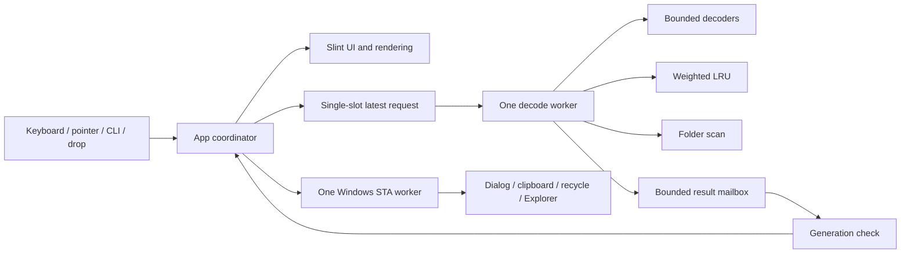

# Architecture

One Rust package, with separate modules for application coordination, UI,
viewer transforms, decoder adapters, animation timing, weighted cache, folder
navigation, centralized input, Windows integration, settings, errors and limits.
The decoder never imports Slint. The UI never parses image files.

The foreground request increments a shared generation and replaces pending
work. Cancellable reads and per-frame checks stop old work where possible.
Only the matching generation can update the view. Preload ordering is next,
then previous, with no additional speculative radius. A codec already executing
inside one call can delay the next request; there is no thread kill or unsafe
cancellation. One worker bounds decode concurrency and peak overlap.

The old picture remains visible while a new request is pending. A failed request
shows an error and retains folder navigation. Destructive/copy operations require
the displayed image to match the requested path, so a stale picture cannot cause
an action on a different file.

Frames are decoded/composited by image-rs, not the UI. GIF loop extensions are
parsed structurally to distinguish no extension, infinite repetition and finite
additional repetitions. APNG/WebP supply total loop counts. The UI uses a
single-shot timer per frame; no animation polling runs while idle or paused.
Animation storage is bounded, but currently fully collected before presentation.

The renderer uploads one current RGBA frame to Slint. Cache entries and the app
share an Arc of decoded frames. Renderer copies and textures are accounted for
as separate costs, not hidden inside the cache budget. Transform properties
handle zoom, rotation and flips without rewriting source pixels.

Folder enumeration reads names and file types only. It never decodes every file,
extracts EXIF from the directory or generates thumbnails. Natural numeric runs
are compared by significant digit count and lexical value, avoiding integer
parsing/overflow. Navigation clamps at folder ends.

Windows APIs are wrapped locally; Shell objects live on an STA worker. Each
launch owns its window and workers. There is no daemon, mutex protocol, IPC,
network client or single-instance dependency. Shutdown cancels pending work and
does not block the UI waiting for a non-cooperative decoder to finish.
