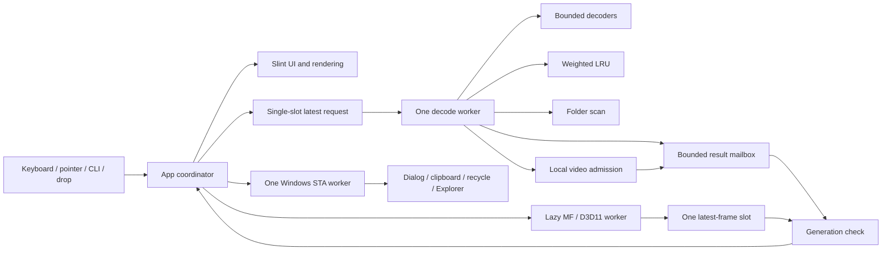

# Architecture

One Rust package, with separate modules for application coordination, UI,
viewer transforms, decoder adapters, animation timing, weighted cache, folder
navigation, centralized input, Windows integration, settings, errors and limits.
The decoder never imports Slint. The UI never parses image files.

```mermaid
flowchart LR
    Input[Keyboard / pointer / CLI / drop] --> App[App coordinator]
    App --> UI[Slint UI and rendering]
    App --> Latest[Single-slot latest request]
    Latest --> Worker[One decode worker]
    Worker --> Decoder[Bounded decoders]
    Worker --> Cache[Weighted LRU]
    Worker --> Folder[Folder scan]
    Worker --> Results[Bounded result mailbox]
    Results --> Guard[Generation check]
    Guard --> App
    Worker --> Admission[Local video admission]
    Admission --> Results
    App --> Video[Lazy MF / D3D11 worker]
    Video --> Frame[One latest-frame slot]
    Frame --> Guard
    App --> Shell[One Windows STA worker]
    Shell --> Win32[Dialog / clipboard / recycle / Explorer]
```

Decoders live in `src/decoder.rs` (dispatch, orientation, colour, fitting) and
`src/codecs` (JPEG XL, SVG, camera RAW, AVIF, HEIC). `src/format.rs` identifies a
file from its first 2,048 bytes; the extension decides only for formats without a
signature. Formats the `image` crate reads go through `image_pending`; the others
return the same `Pending` value from `codecs::decode`, and `finish` then applies
orientation, fitting, sRGB conversion and the alpha check, so every format takes
the same last steps. AVIF and HEIC share `isobmff.rs` and `heif.rs` (container,
grids, alpha, rotation) and `yuv.rs` (YUV to RGB); AV1 is decoded by rav1d on a
short-lived thread of its own and HEVC by `codecs/hevc`, whose stages are bit
reading, parameter sets, slice headers, CABAC, coding tree, intra prediction,
inverse transforms and the deblocking and SAO filters. Decoders take a
`decoder::Source` (read and seek) so they work on a file and on a Shell stream.

The foreground request increments a shared generation and replaces pending
work. Cancellable reads and per-frame checks stop old work where possible.
Only the matching generation can update the view. Preload ordering is next,
then previous, with no additional speculative radius. The worker waits 150 ms
for a newer request before it starts a preload, because a codec cannot be
interrupted once its bytes are read and a preload begun between two key presses
would delay the picture that matters. Content decides whether a file is a video
only after the image decoders decline it, which saves an open per picture. A codec already executing
inside one call can delay the next request; there is no thread kill or unsafe
cancellation. One worker bounds decode concurrency and peak overlap.
If display-size refinement replaces an initial request before its folder scan
finishes, the new request inherits that scan so navigation still becomes ready.

The old picture remains visible while a new request is pending. A failed request
shows an error and retains folder navigation. Destructive/copy operations require
the displayed image to match the requested path, so a stale picture cannot cause
an action on a different file.

Frames are decoded/composited by image-rs, not the UI. GIF loop extensions are
parsed structurally to distinguish no extension, infinite repetition and finite
additional repetitions. APNG/WebP supply total loop counts. The UI uses a
single-shot timer per frame; no animation polling runs while idle or paused.
Animation storage is bounded. The first composited frame is delivered as soon
as it is fitted, and later frames append while that generation is still current.
A one-frame file is not announced twice.

Shrinking is done by `resample`: whole-number block averaging first, then a
two-tap bilinear pass, so a large reduction stays cheap and no full-size
intermediate exists. A JPEG is shrunk from its RGB buffer, then oriented and
widened to RGBA at display size.

The renderer uploads one current RGBA frame to Slint. Cache entries and the app
share an Arc of decoded frames. Renderer copies and textures are accounted for
as separate costs, not hidden inside the cache budget. Transform properties
handle zoom, rotation and flips without rewriting source pixels.

Folder enumeration reads names and file types only. It never decodes every file,
extracts EXIF from the directory or generates thumbnails. Ordering by date or
size uses the metadata that directory enumeration already returns. The default
name order is the Shell's own logical comparison (`StrCmpLogicalW`), so the
sequence matches Explorer; it falls back to the portable comparison if the
standard sort ever rejects the Shell's order. Natural numeric runs
are compared by significant digit count and lexical value, avoiding integer
parsing/overflow. Navigation clamps at folder ends.

Windows APIs are wrapped locally; Shell objects live on an STA worker. Each
launch owns its window and workers. There is no daemon, mutex protocol, IPC,
network client or single-instance dependency. Shutdown cancels pending work and
does not block the UI waiting for a non-cooperative decoder to finish.

## Explorer previews

The workspace member `crates/thumbnail` builds `kova_thumbnails.dll`, a COM
in-process server for `IThumbnailProvider` and `IInitializeWithStream`. It links
the `kova_image` library, so it uses `decoder::load_stream` and the same format
code as the viewer; nothing is duplicated. It is registered per user by
`windows_integration::thumbnails` (HKCU only) and is not loaded unless
registered. See [FILE_ASSOCIATIONS.md](FILE_ASSOCIATIONS.md#explorer-previews)
and [SECURITY_ARCHITECTURE.md](SECURITY_ARCHITECTURE.md#explorer-thumbnail-provider).

## Local video

`media` owns mixed-format classification and bounded local container admission.
`video` owns a coalesced desired-state mailbox and a dedicated MTA worker.
`video/native` isolates Media Foundation/D3D resources and `video/stream` supplies
a seekable read-only COM stream over the admitted handle. `app/video` prepares the Slint shared pixel buffer on the worker, applies a
generation guard on the UI and presents frames without a UI-thread pixel copy. None of these decoder modules imports UI.

Switching files stops old playback. Videos are never preloaded, cached as whole
frame sequences or started by folder enumeration. Video metadata and frames
cross one latest-update slot; state-only updates retain the pending frame.
Image handling keeps the existing decode worker/cache. Native calls are not
forcibly interrupted; the UI ignores old generations while the worker releases
old engine resources. A slow native operation can delay the next video request.

Recycling a video sends Stop and waits for its resource-release acknowledgement
on the Shell worker. The UI remains responsive. Registration writes only the
application's documented per-user Capabilities/ProgID/OpenWith entries; Windows
owns default selection. See [FILE_ASSOCIATIONS.md](FILE_ASSOCIATIONS.md).
