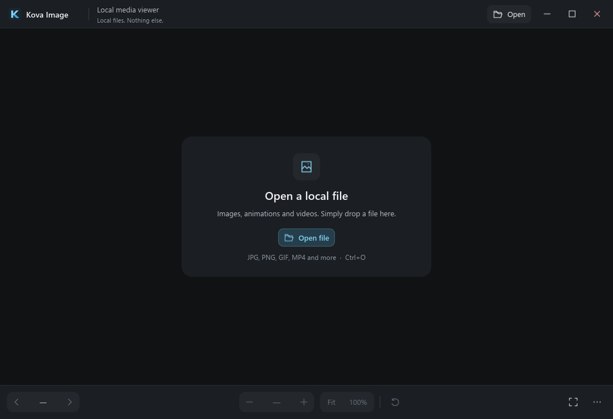

# Kova Image interface

The image is the primary surface. Chrome provides orientation and a few precise
actions without resembling an editor or a media library.

## Design system

`ui/theme.slint` owns the palette and shared metrics. It retains Kova File's
cyan identity and Segoe UI typography while using darker, more neutral surfaces
appropriate for viewing images.

| Role | Value |
| --- | --- |
| Image canvas | `#101214` |
| Header, control bar, popovers | `#1b1e22` |
| Control groups | `#24282d` |
| Hover / pressed | `#30363d` / `#3a434c` |
| Primary / secondary text | `#f0f2f5` / `#b2bac4` |
| Supporting text | `#8d98a5` |
| Selected surface / Kova accent | `#253e4b` / `#86d5f4` |
| Subtle divider | `#2b3036` |

The 50 px header balances the existing Kova mark, filename, format and dimensions.
The 60 px bottom surface contains 32 px controls in 36 px groups: navigation,
zoom, fit mode, transforms/playback, and fullscreen/more. Below 820 px the Open
label and spacing become compact; controls retain their hit areas. The minimum
window remains 640 × 420. Popovers scroll within short windows.

The shared `Tool`, `ToggleRow`, `Group`, `Rule` and `Divider` components in
`ui/controls.slint` provide consistent enabled, disabled, hover, pressed, active
and keyboard-focus states. Original utility icons in `assets/icons/` use one
24-unit grid and stroke weight; `ui/icons.slint` exposes them to the UI.
No icon font, network asset, blur, acrylic or shadow dependency is required.

Normal labels are 13 px. File details and version text use 11–12 px; 10 px
uppercase section labels are supplemental, never the sole label of a control.
Accent marks selection and keyboard focus. Red is reserved for destructive
actions and errors. Small images retain their natural size in Fit mode.

## Interaction

- Navigation shows folder position and disables directions at folder boundaries.
- Fit and 100% indicate the selected view mode; the zoom value remains explicit.
- Icon actions expose descriptive accessibility labels and on-screen hints.
- Tab traverses controls; Space/Enter activate a focused button. Clicking the
  image or dismissing a popup restores focus to the viewer. Space then controls
  animation playback.
- Escape dismisses the current popup before leaving fullscreen. Clicking outside
  More dismisses it. Settings and information share the same panel structure.
- Fullscreen uses a compact floating control surface. After two seconds of
  inactivity, header and controls fade over 120 ms. Hovered controls, open
  popovers and keyboard-focused controls remain available.
- Empty, loading and error states have distinct, concise text. Decode failures
  retain folder navigation. Successful action notices expire after five seconds.
- Image information uses label/value rows, with wrapping paths. View transforms
  continue to leave original files unchanged.

Focus behavior uses Slint's
[FocusScope events](https://docs.slint.dev/latest/docs/slint/reference/keyboard-input/focusscope/)
and explicit ownership so destroying a popup cannot leave a stale focus count.

## Performance constraints

The image decoder and cache budgets retain their existing behavior. The video
worker is separate and initialized only for video. Only the two small chrome surfaces animate opacity, and only
during show/hide transitions. No animation is attached to the image or canvas.
Metadata rows are updated on load/information requests, never per animation frame.
No new Cargo dependencies were added.

During animated images, the renderer may cache the header and bottom bar as two
small surfaces, so unchanged icons and text do not require individual draw calls
on every frame. This hint is disabled for still images. It trades bounded chrome
texture memory for less CPU work; the image itself is never cached in this layer.
See Slint's [rendering-cache guidance](https://docs.slint.dev/latest/docs/slint/reference/common/#cache-rendering-hint).

The viewport now has a 12 px inset in windowed mode. Cursor-anchored zoom accounts
for that offset; fullscreen uses the full viewport. Geometry is still calculated
by the existing Rust view model.

## Local video presentation

Video uses the same header, canvas, controls and fullscreen behavior. The image
zoom/transform groups yield to a single transport segment: Play/Pause, timeline,
time and mute/volume. Both sliders use `ui/track.slint`, with 32 px pointer targets,
visible keyboard focus and commit-on-release seeking. No per-pointer-move seek
queue is created. Slint retains equal time strings between whole-second changes.

Buttons use 9 px corners; control segments use 11 px, panels 14-16 px and the
compact empty-state card 18 px. Windows 11 window corners are requested through
DWM, retaining native maximized/fullscreen behavior and older-Windows fallback.

## Remaining visual validation

- Physical multi-monitor 125–200% DPI transitions, touchpads and screen readers.
- Windows high-contrast/reduced-motion preferences are not yet integrated into
  the custom theme; the design does not claim full accessibility conformance.
- Native file picker and Explorer/Open With surfaces retain Windows styling.
- More codec profiles, native video orientation and device-loss recovery need validation.

Local renderer captures and interaction checks are described in
[PERFORMANCE.md](PERFORMANCE.md); generated captures stay in `artifacts/`.

Actual before/after measurements, including memory costs, are recorded in
[UI_MEASUREMENTS.md](UI_MEASUREMENTS.md).

The compact UI and local video extension has a separate
[measurement record](VIDEO_MEASUREMENTS.md).
